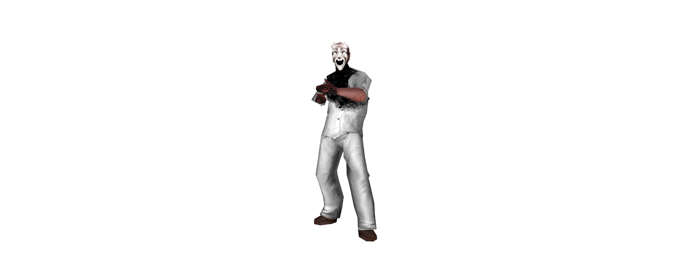
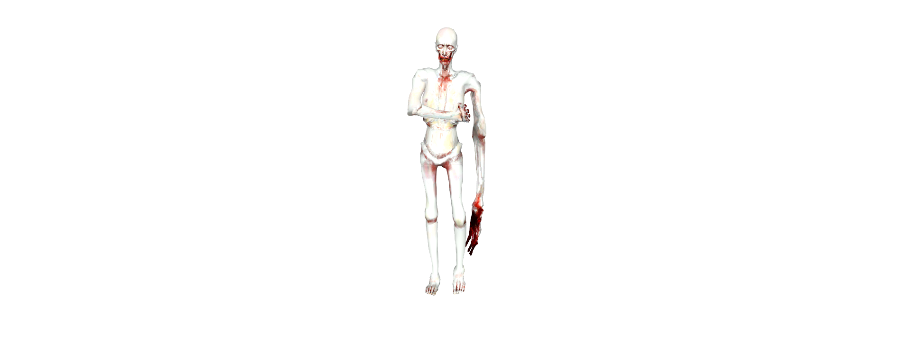
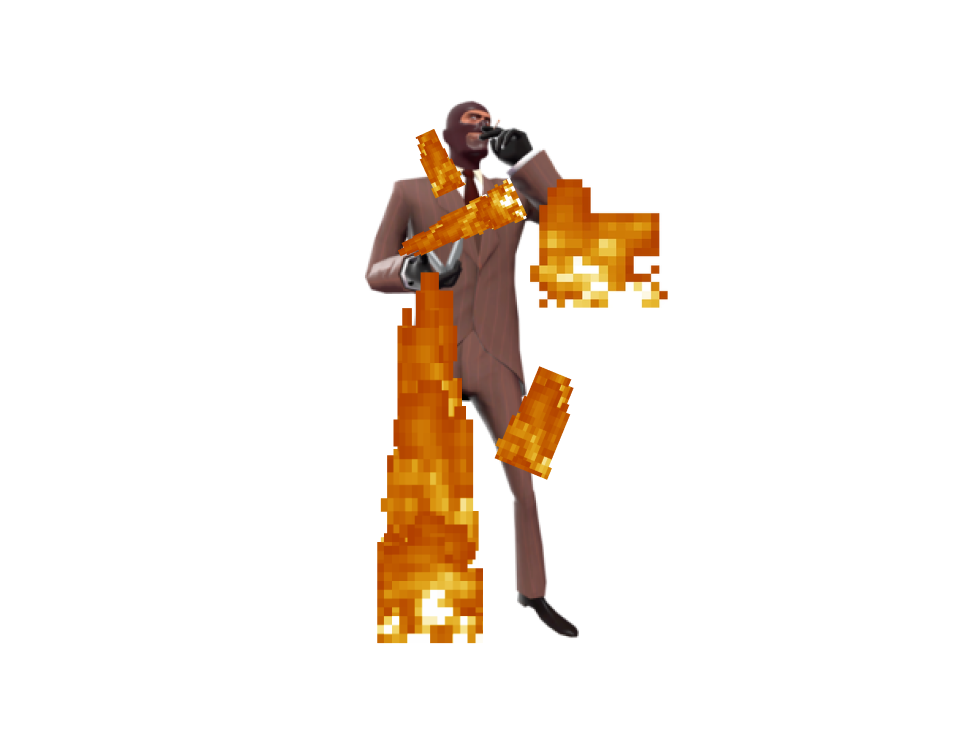

# Los roles del Modo de Juego

El modo de juego cuenta con una amplia categoría de Roles, cada uno con su propias metas y propositos.

## Clase-D

Encerrados en las celdas y liberados de repente, los Clase-D son el rol más común que aparece los cuales no cuentan con ningun objeto, pero siempre aparecen en la misma area de la Zona de Light Containent.

!!! info "Propósito"
    Como Clase-D, el proposito de estos es el de escapar ilesamente de las instalaciones utilizando los recursos del mapa para poder escapar, evitando a los SCP hostiles, a los Guardias de las Instalaciones y los MTF (y tambien matar algunos cientificos, en caso de que se presente la oportunidad). 

??? examples "Imagen de Clase-D"

    

## Científico

Los Científicos tiene una aparición menor a diferencia de los Clase-D, pero que siempre aparecen con una tarjeta de Científico y un botiquín, generandose por lo general un poco alejados de Heavy Containment (dependiendo del mapa, algunos aparecen en Light Containment).

!!! info "Propósito"
    Su propósito, al igual que la Clase-D, es escapar de las facilidades, con la gran diferencia de que estos pueden ser asistidos por los Guardias de las Instalaciones y los MTFs, por lo que los cientificos no pueden recibir daño de estos. La gran diferencia con la Clase-D es que, como son escasos en número, son objetivos mucho más fáciles.

??? examples "Imagen de Científico"

    

## Guardia de las Instalaciones

Los Guardias de las Instalaciones son un conjunto de jugadores que se generan con menor frecuencia los cuales siempre aparecen por lo general en la Heavy Containment con los siguientes objetos:

- Tarjeta de acceso del Guardia de las Instalaciones.
- Arma FSP-9.
- Granada Flash
- Radio.
- Botiquin de Salúd.
- Armadura ligera.

!!! info "Propósito"
    Como se ha mencionado antes, su propósito es escoltar a los científicos para que puedan escapar y desarmar u vigilar a cualquier Clase-D que se encuentre en su camino, llevandolos a la salida tambien o posiblemente teniendo que matar a algunos en caso de que estos empiecen a atacar. A su vez, tambien debe abrir fuego contra cualquier SCP con el que se encuentren.

??? examples "Imagen de Guardia de las Instalaciones"

    

## Los SCP y sus variantes

Los SCP son una escasa cantidad de jugadores (generalmente entre 1-3 o mas dependiendo de la cantidad de gente en el Servidor), con más de unos pocos tipos diferentes de SCP seleccionados aleatoriamente. No aparecen ni tampoco pueden usar cualquier tipo de objetos (salvo algunas pequeñas excepciones), se generan en diferentes lugares (comunmente en Heavy Containment), y tienen sus propios poderes unicos en cambio, ademas de una gran cantidad de vida segun el tipo. 

!!! info "Propósito"
    El proposito de los SCPs es matar a todo aquel que se encuentre en tu camino y evitar que escapen los Clase-D y Científicos. Usando los poderes que tienes (y con la ayuda de los demás SCPs, los cuales no tienen el Chat de Voz y Texto por proximidad), debes elimitar a todos en el Laboratorio y, de ser posible, escapar a la superficie para causar mas caos (obvio dependiendo del tipo de SCP: al ser un lugar abierto, es muy factible que te asesinen entre varios sin poder reaccionar y llegar a asesinar a todos).

Como hay distintos tipos de SCP, a continuación encontraras los distintos tipos y sus cualidades únicas.

### SCP-035

El SCP-035, conocido como la mascara que controla gente, es un SCP que tiene permitido portar objetos dentro de un inventario a diferencia de los demás SCPs, interactuar con el mapa, etcetera.  

??? examples "Imagen de SCP-035"

    

### SCP-049

El SCP-049 es el doctor de la plaga, el cual mata instantaneamente a cualquiera que toque con su arma cuerpo a cuerpo. Con su cuchillo (que vendria siendo la Medi-Gun al pulsar la tecla 2), puede revivir a aquellos que haya matado recientemente como Zombies (SCP-0492) para que cumplan sus ordenes y lograr la victoria. 

!!! info "Datos útiles"
    A pesar de matar instantaneamente, es bastante lento y la mayoria puede superarlo facilmente. Por ello, es mas util cuando puede acorralar a objetivos que no tengan armas o que no tengan escape.

??? examples "Imagen de SCP-049"

    

### SCP-076

El SCP-076 es un humanoide que va en busca de sangre, el cual tras conseguir 5 asesinatos, entra en su modo de furia donde se vuelve mas poderoso, permitiendo matar a todos de forma instantanea con su arma cuerpo a cuerpo.

!!! info "Datos útiles"
    SCP-076 puede traspasar puertas.

??? examples "Imagen de SCP-076"

    

### SCP-096

El SCP-096, tambien conocido como el llorica, tiene una forma rara, pálida y alta. Normalmente no puede atacar, ademas de que camina lentamente por los pasillos, escondiendo su cara hasta que algun jugador lo mire directamente a los ojos. Cuando alguien lo mira a la cara, el SCP-096 entra en un estado de Stun y se prepara para entrar en su modo furia, donde ganará mucha velocidad de movimiento, puede romper todas las puertas (a excepción de algunas) y podrá matar de forma instantanea a todo aquel que lo haya visto. 

??? examples "Imagen de SCP-096"

    

### SCP-106

El SCP-106 (o el viejo/viejito como le dicen algunos), es un humanoide anciano de color negro con grandes poderes. Es lento al igual que el SCP-049, pero cuando ataca a un jugador, este es teletransportado a la dimensión de bolsillo, un pequeño lugar con varios caminos separados que se asemeja a una trinchera. Solo uno de ellos te puede liberar, dejandote sano y salvo en la sala de contención del SCP-106 (en cambio, elegir el incorrecto te matará instantaneamente).

!!! info "Datos útiles"
    - El SCP-106 puede poner un portal en el lugar donde se encuentre con el clic derecho del ratón (+attack2), al cual podrá teletransportarse en cualquier momento con el clic en la rueda del ratón (+attack3), sirviendole como plan de escape, para volver rapidamente a una localización que debas ir, o para sorprender al enemigo.
    - Al igual que el SCP-076, este puede transpasar puertas, dando la posibilidad de poder abrirle a los demás SCPs.
    - Tiene una gran resistencia a las balas, aunque tiene vida mucho menor a los demás SCPs.
    - A pesar de todas las ventajas, el SCP-106 tiene una gran debilidad que se encuentra explicada en las Zonas del mapa (el Rompefémures).

??? examples "Imagen de SCP-106"

    

### SCP-173

El SCP-173 (o maní) es una escultura de concreto que es solo una estatua que no se puede mover, pero si apartas tu vista de este o lo miras lo suficiente, este podrá teletransportarse y matarte al instante. 

!!! info "Datos útiles"
    - El SCP-173 puede obtener una bonificación masiva de velocidad apretando la tecla de Recargar arma (+reload) siempre y cuando se encuentre cargada.
    - A su vez, puede crear trampas las cuales hacen mas lento al que la pise, creandose con el clic en la rueda del ratón (+attack3).

??? examples "Imagen de SCP-173"

    

### SCP-457

El SCP-457 (no había una mejor imagen para describir al SCP, mil disculpas), está hecho de fuego, el cual toma una forma humana. Sus ataques provocan que cualquiera que toques, se prendan fuego.

!!! info "Datos útiles"
    - Cuantos mas asesinatos tengas, mas tiempo durará el fuego en los humanos, y si consigues aún mas asesinatos, te separaras en dos, generando un clon de ti mismo con los mismos poderes y proposito.
    - Si no alcanzas a matar, te quemarás hasta morir. 
    - Morirás tambien si tocas agua (en los mapas que la tengan).
    - Puedes curarte 50 de vida con objetos tirados en el piso por personas con el clic derecho del ratón (+attack2). 

??? examples "Imagen de SCP-457"

    

### SCP-939

El SCP-939 (los perritos) son unos depredadores que pueden hablar con los humanos para simular su voz (en terminos de gameplay, tu chat de voz luce como el de cualquier otro humano), puede correr y se mueve mas rapido cuanta menos vida tenga. 
    
!!! info "Datos útiles"
    Su gran defecto, es que solo podrá ver a los jugadores cuando estos se encuentran moviendo o haciendo ruido, pero que se puede evitar facilmente estando agachado cuando se nota la presencia del SCP-939. 

??? examples "Imagen de SCP-939"

    

## Insurgente del Caos

Los Insurgentes del Caos son un grupo de jugadores muertos que re-aparecen tras cierta cantidad de tiempo en una ronda, en un grupo de Agentes, Fusileros, Intrusos y Represores (cada uno de estos cuenta con un tipo distinto de Armas y tarjeta).

!!! info "Propósito"
    El proposito de los Insurgentes del Caos es esencialmente el de eliminar a todos los MTF, asistir a los Clase-D para que logren escapar y el de matar a cualquier científico que intente escapar. Y, obviamente, eliminar a los SCP.

??? examples "Imagen de Insurgente del Caos"

    

## MTF (Unidades de Fuerzas Especiales)

Los MTF (Unidades de Fuerzas Especiales) son un grupo de jugadores muertos que re-aparecen tras cierta cantidad de tiempo en una ronda, en un grupo de Soldados, Sargentos, Especialistas, Ingenieros y Capitán (cada uno de estos cuenta con un tipo distinto de Armas y tarjeta).

!!! info "Propósito"
    El proposito de los MTF es el de asistir a los Científicos para que logren escapar, desarmar y escoltar a Clase-D para que escapen como tu bando (o asesinarlos, tu decides), eliminar a todos los SCP y todo Insurgente del Caos que quede vivo en los Laboratorios.

??? examples "Imagen de MTF"

    