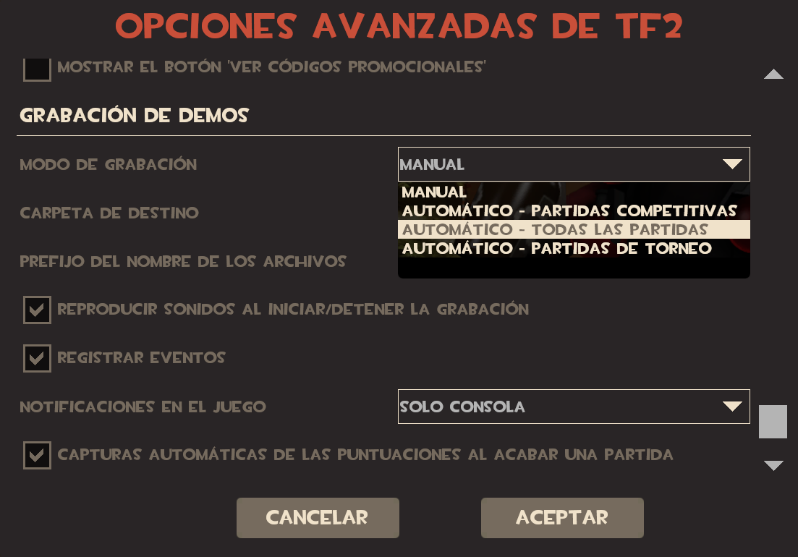

# Servidores de juego

1. No hagas trampa, de cualquier tipo.

    ??? examples "Ejemplos"

        - Cheats o hacks
        - Macros (como el BunnyHop, los binds están permitidos)
        - Exploits (Si encuentras uno accidentalmente, reportalo inmediatamente en el Discord)

2. No alargues partidas a propósito.

    !!! info "¡Información!"

        Esto incluye, pero no se limita a:

        - Intencionalmente evitar al enemigo para hacer tiempo.
        - Intencionalmente no capturar el punto.
        - Campear en lugares inaccesibles por el enemigo, o a los que sea extraordinariamente acceder.
        - (**DODGEBALL**) Orbitar un cohete alrededor tuyo por más de 10 segundos.
        - (**JAILBREAK**) Campear en armería, entrar y salir constantemente.
        - (**FREAK FORTRESS 2**) Estar intentando hacer Market-Garden como 5 u 8 minutos sin haber hecho daño.

3. Está prohibido hacer "ghosting".

    !!! info "¡Información!"

        Se denomina como "ghosting" al acto de informar a los vivos información util de la partida por cualquier medio mientras uno se encuentra muerto. Esto aplica a todos los medios, desde los públicos tales como el chat de voz del servidor, comandos como el `!8ball`, a privados como mensajes directos y otros.

    !!! info "Excepciones"

        La única excepción a esta regla en el caso de que una persona esté rompiendo una regla

    ??? example "Ejemplos"

        - "<MUERTO> Usuario: El prisionero restante está al lado del Dispenser"
        - "<MUERTO> Usuario: La contraseña es 1234"
        - "<MUERTO> Usuario: Se quedó AFK el engineer"

4. No permanezcas en una área por más de 30 segundos (camping).

    !!! info "Excepciones"
        Está permitido campear en casos donde las posibilidades de trasladarse de un lugar a otro resulten en posibilidades casi nulas de sobrevivir
        (**FREAK FORTRESS 2**) Está permitido campear solo con las siguientes clases, excepto si eres jefe:

        - Heavy.
        - Engineer.
        - Sniper.

Te recomendamos siempre tener habilitadas las grabaciones automáticas desde TF2. Puedes hacer esto digiéndote a las opciones avanzadas de TF2, ir hacia abajo de todo y en "Modo de grabación" seleccionar "Automático - Todas las partidas".

??? examples "Captura de pantalla"

    